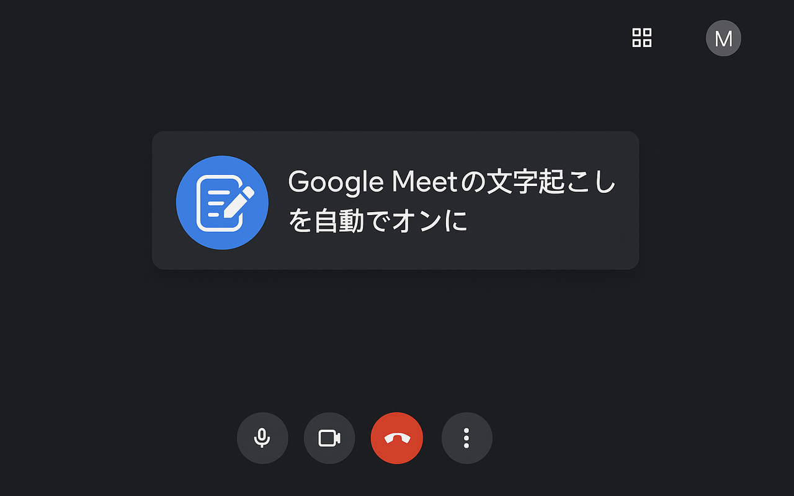

# Google Meet 文字起こし自動開始 Chrome 拡張機能

Google Meet で自動的に文字起こしを開始する Chrome 拡張機能です。



## 🚀 機能

- Google Meet に参加すると自動的に文字起こし機能を有効化
- 会議メモパネルを自動で開き、「文字起こしも開始する」をチェック
- 堅牢なエラーハンドリングと再試行機能
- 既に文字起こしが有効な場合は処理をスキップ

## 📦 インストール

### Chrome Web Store から（推奨）

[Chrome Web Store からインストール](https://chromewebstore.google.com/detail/google-meet-%E6%96%87%E5%AD%97%E8%B5%B7%E3%81%93%E3%81%97%E8%87%AA%E5%8B%95%E9%96%8B%E5%A7%8B/epmnedcdliigkeecnaloejlneeejfifm)

1. 上記リンクをクリック
2. 「Chrome に追加」ボタンをクリック
3. 確認ダイアログで「拡張機能を追加」をクリック

### 開発者モードでインストール

1. このリポジトリをクローン
2. 開発用インストールスクリプトを実行:
   ```bash
   ./scripts/dev-install.sh
   ```
3. 表示される手順に従って Chrome に拡張機能をインストール

## 🛠️ 開発

### 必要な環境

- bash (macOS/Linux)
- Google Chrome

### 開発手順

1. **コードを編集**

   ```bash
   # src/content.js を編集
   ```

2. **開発用ビルド・インストール**

   ```bash
   ./scripts/dev-install.sh
   ```

3. **Chrome で拡張機能をリロード**
   - `chrome://extensions/` にアクセス
   - 拡張機能の「更新」ボタンをクリック

### リリース手順

1. **バージョンアップ・パッケージング**

   ```bash
   ./scripts/package.sh
   ```

   _自動的にパッチバージョンがインクリメントされます_

2. **Chrome Web Store にアップロード**
   - `dist/` フォルダ内の zip ファイルをアップロード

### クリーンアップ

```bash
./scripts/clean.sh
```

## 📂 プロジェクト構造

```
project/
├── src/                    # ソースファイル
│   ├── manifest.json       # 拡張機能の設定
│   ├── content.js          # メイン処理スクリプト
│   └── icon*.png          # アイコンファイル
├── scripts/                # ビルドスクリプト
│   ├── build.sh           # ビルド実行
│   ├── package.sh         # パッケージング
│   ├── clean.sh           # クリーンアップ
│   ├── dev-install.sh     # 開発用インストール
│   └── README.md          # スクリプト詳細説明
├── build/                  # ビルド出力（自動生成）
├── dist/                   # パッケージ出力（自動生成）
└── README.md              # このファイル
```

## 🔧 技術詳細

### 対応サイト

- Google Meet (`https://meet.google.com/*`)

### 主な処理フロー

1. Google Meet ページの読み込みを検知
2. 会議メモパネルを自動で開く
3. 「文字起こしも開始する」チェックボックスを有効化
4. 「メモの作成を開始」ボタンをクリック
5. 文字起こしセッションが開始される

### 堅牢性の特徴

- 最大 2 回まで自動リトライ
- 既に文字起こしが有効な場合は処理をスキップ
- 「しばらくお待ちください」メッセージ中は待機
- 30 秒間隔での定期チェック

## 📋 スクリプト詳細

各スクリプトの詳細な使用方法については、[scripts/README.md](scripts/README.md) をご覧ください。

## 🔗 関連リンク

- [Chrome Web Store Developer Dashboard](https://chrome.google.com/webstore/devconsole)
- [Chrome 拡張機能開発ガイド](https://developer.chrome.com/docs/extensions/)
- [Manifest V3 ドキュメント](https://developer.chrome.com/docs/extensions/mv3/)

## 📄 ライセンス

MIT License

## 🤝 コントリビューション

プルリクエストやイシューの報告を歓迎します。

---

**現在のバージョン**: v1.0.8
**Chrome Web Store**: [インストールはこちら](https://chromewebstore.google.com/detail/google-meet-%E6%96%87%E5%AD%97%E8%B5%B7%E3%81%93%E3%81%97%E8%87%AA%E5%8B%95%E9%96%8B%E5%A7%8B/epmnedcdliigkeecnaloejlneeejfifm)
